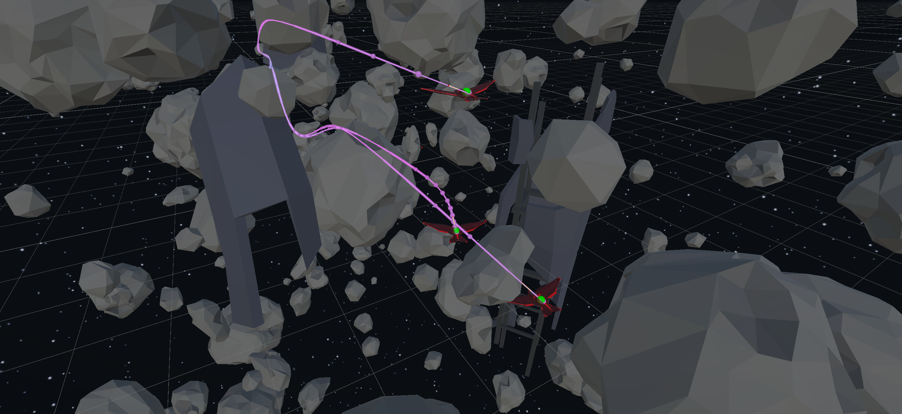
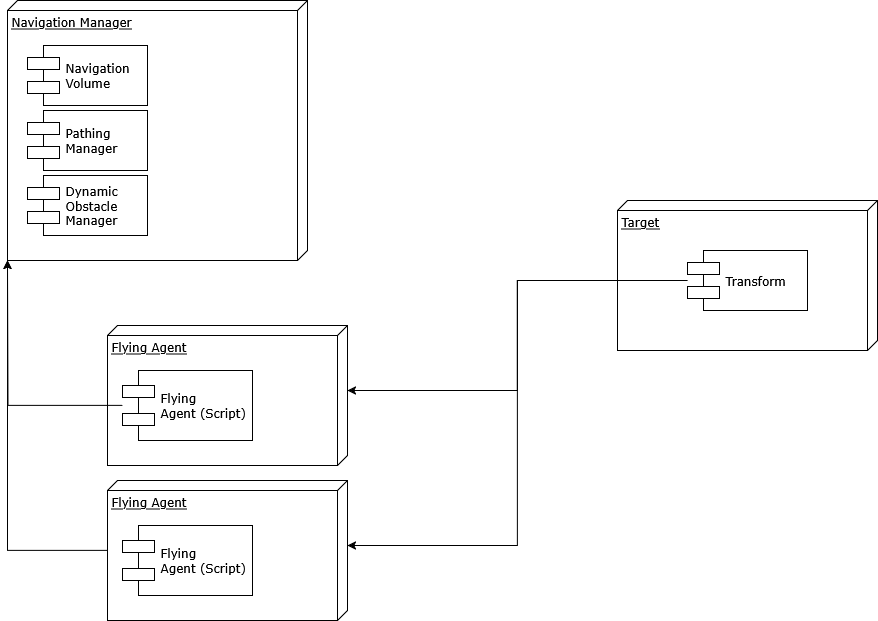
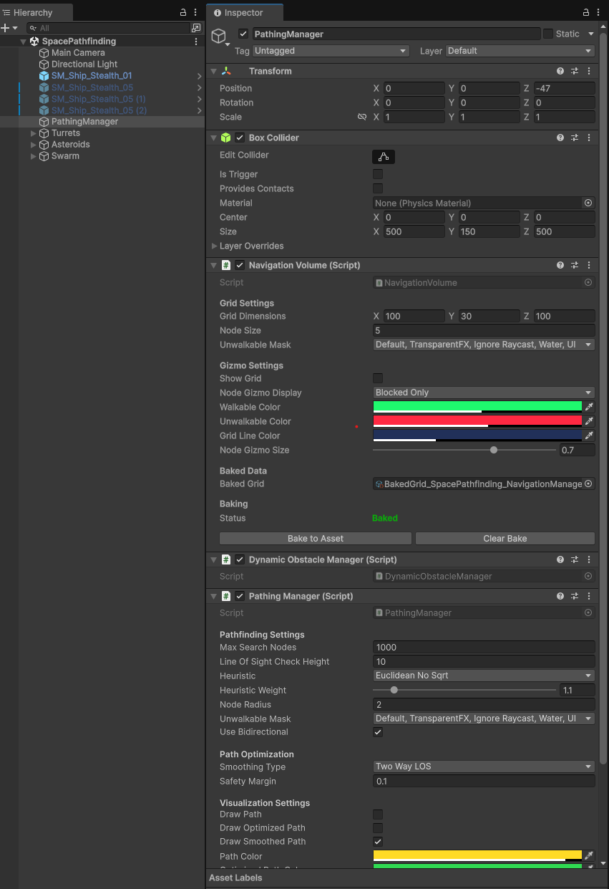
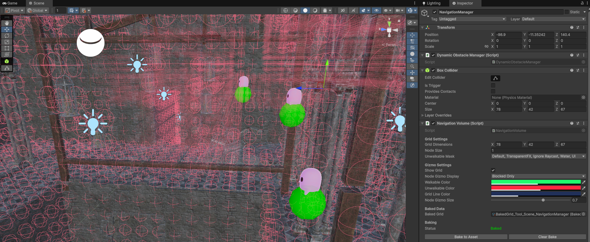
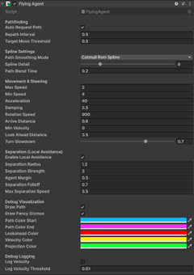
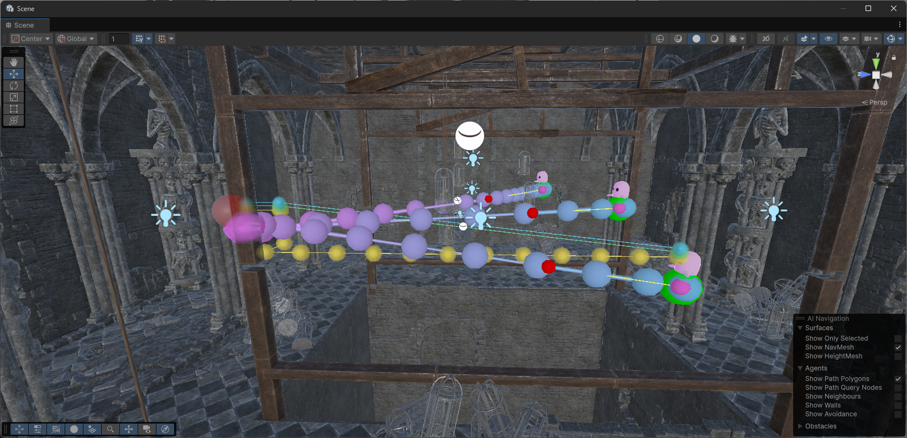
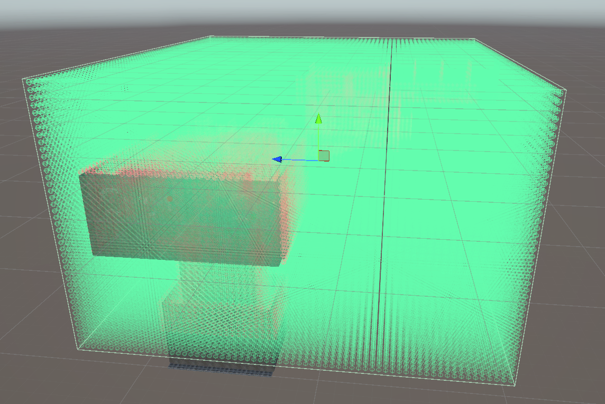
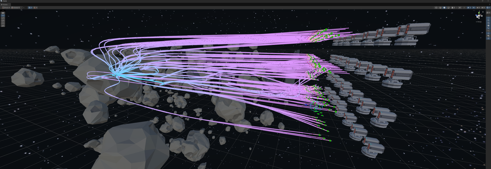

# Spatial Pathfinding Tool — User Guide

<div align="center">



</div>

Thank you for using the “Spatial Pathfinding” Tool from TecMaid
This guide is meant to help with the setup of the **Spatial Pathfinding Tool** in a scene
quickly and easily to get familiar with the tool and explains the settings of the
components.

The tool was made to be able to be dropped into a scene, set up in the Unity Editor,
and get something moving within a 3D space in minutes without any changes to the
code.

If you have any questions, encounter a problem or need help with integration, please do
not hesitate to contact us at service@tecmaid.com

## Table of Contents
- [Components](#components)
- [Quick Start (5 minutes)](#quick-start-5-minutes)
- [Scene-by-Scene Setup (recommended workflow)](#scene-by-scene-setup-recommended-workflow)
    - [Optional: Bake the Grid](#optional-bake-the-grid)
- [Adding Obstacles (static vs. dynamic)](#adding-obstacles-static-vs-dynamic)
    - [Static obstacles (level geometry)](#static-obstacles-level-geometry)
    - [Dynamic obstacles (moving hazards, doors, AI)](#dynamic-obstacles-moving-hazards-doors-ai)
- [Flying Agent](#flying-agent)
- [Pathing Manager global behaviour and performance](#pathing-manager-global-behaviour-and-performance)
- [Navigation Volume](#navigation-volume)
- [The “Make It Move” Example (PathfindingTester)](#the-make-it-move-example-pathfindingtester)
- [Agent behaviour script (Custom PathfindingTester)](#agent-behaviour-script-custom-pathfindingtester)
- [Tips and Good Defaults](#tips-and-good-defaults)
- [Common Pitfalls and Fixes](#common-pitfalls-and-fixes)
- [Working with Multiple Agents and Obstacles](#working-with-multiple-agents-and-obstacles)
- [Recommended Layer Setup](#recommended-layer-setup)
- [Checklist before hitting Play](#checklist-before-hitting-play)
- [FAQ](#faq)
- [Final Notes](#final-notes)

## Components
* **Navigation Volume** – a 3D grid the agents navigate in.
* **Pathing Manager** – the brains: Finds and smooths paths, handles batches.
* **Flying Agent** - a ready-to-use movement controller that follows paths.
* **Dynamic Obstacle Manager** - makes moving obstacles aƯect paths.
* **Navigation Obstacle** - tags any object with a collider as a dynamic obstacle.
* **Pathfinding Tester** - a plug-and-play “make it move” code example.

For the quick start/setup, only these components on GameObjects will be required. No
code changes in a script.

<div align="center" style="background:#ffffff;">



</div>

## Quick Start (5 minutes)
A quick guide to set up an existing scene with a single Flying agent and a target to move to. 

1) **Create the Navigation system**
* In the **Hierarchy**, create an empty GameObject called **Navigation**.
* Add the **NavigationVolume** and **PathingManager** script components.
* The tool will auto-add the required **DynamicObstacleManager**.
2) **Define where the agents can fly**
* On **NavigationVolume**, set:
  * **Grid Dimensions** (e.g.,50, 10, 50)
  * **Node Size** (start with 1.0)
  * **Unwalkable Mask:** choose one or more layers that will block the agents path (e.g., “NavBlocker”)

<div align="center">



</div>

* (Optional) Toggle **Show Grid** to visualize in Scene view.


<div align="center">



</div>

3) **Add a flying agent**
* Create a new GameObject, add a visible mesh (e.g., a Capsule).
* Add the **FlyingAgent** component. Keep defaults for now.

<div align="center">



</div>

4) **Add a target to fly to**
* Create a GameObject named Target and place it somewhere inside the **NavigationVolume**.
5) **Make it move (zero code option)**
* Add the **PathfindingTester** script to the GameObject the agent should fly to.
* In the PathfindingTester component reference the following GameObjects:
  * **Flying Agent** → assign the Agent
  * **End Point** → assign the Target
* Press **Play** and move the **Target** while playing; the agent re-paths and follows the target.

<div align="center">



</div>

## Scene-by-Scene Setup (recommended workflow)
When adding the Pathing Tool to a new scene in the same project, repeat the Quick
Start steps:
1. One **Navigation** object per scene:
   * Add NavigationVolume and PathingManager (auto-requires DynamicObstacleManager).
2. **Add the FlyingAgents.**
3. Use **PathfindingTester** for targets (or set destinations from a gameplay scripts later).
Tip: Making a **Prefab** of the **Navigation and FlyingAgent** objects to reuse them across scenes helps keeping the behaviour of flying agents consistent across scenes.

### Optional: Bake the Grid
Baking stores the grid as an asset so scenes load faster and more consistently.
1. Select the **NavigationVolume**.
2. In the Inspector, find the **Baking** section and click **Bake to Asset**.
3. Wait for the progress bar to complete. A **BakedNavigationGrid** asset is created and assigned.
4. **Clear Bake** removes the asset reference so it can be regenerated.

**When to bake**
* When the grid size and the blockers have the desired settings (dynamic path
blockers are unaƯected).
* In large scenes where starting/loading the scene takes a long time during
development. 

## Adding Obstacles (static vs. dynamic)
### Static obstacles (level geometry)
* Put all walls and props on a layer included in the **NavigationVolume → Unwalkable Mask**.
* All GameObjects with a collider on this layer will be captured when the grid is created/baked. 

Make sure convex/concave geometry has a collider and there are no gaps to avoid the
agent pathing outside of enclosed rooms/spaces. 

### Dynamic obstacles (moving hazards, doors, AI)
* Add the **NavigationObstacle** component to any object that has a **collider**.
* The system auto-registers and updates bounds at runtime – the paths adapt as it moves. 

## Flying Agent
Open the FlyingAgent GameObject and tweak the settings in the Inspector. It is
recommended to change only a few settings at a time when setting it up the first time to
see the eƯects of the changes:
* **Pathfinding**
  * **Auto Request Path** – keep ON to refresh paths.
  * **Repath Interval** – how often to re-solve (e.g., 0.5s).
  * **Target Move Threshold** – agent re-paths if target moves this far. 
* **Spline Settings (path smoothing)**
  * **Path Smoothing Mode**
    * **Polyline:** raw path (fastest).
    * **CatmullRomSpline:** smooth, natural.
    * **BezierSpline:** smooth with simple control points.
  * **Spline Detail** - higher = more points.
  * **Path Blend Time** - blends old to new path to avoid pops.
* **Movement & Steering**
  * **Max/Min Speed** – speed envelope.
  * **Acceleration & Damping** – responsiveness and drift.
  * **Rotation Speed** – how quickly the agent turns.
  * **Arrive Distance** – agent considers being “arrived” within this radius.
  * **LookAhead Distance** – how far ahead to steer toward.
  * **Turn Slowdown** – slowing down for sharp turns.
* **Separation (local avoidance)**
  * Enable to reduce crowding/clipping with other **FlyingAgents**.
  * **Separation Radius / Strength / Falloff** - tune to change the feel.
  * **Agent Margin** - personal buƯer for each agent.
  * **Max Separation Speed** - caps avoidance nudge per second.

**Starter preset (copy these)**
* Path Smoothing: **CatmullRomSpline**
* Spline Detail: **10**
* Path Blend Time: **0.2 s**
* Max Speed / Min Speed: **10 / 4**
* Acceleration: **40**
* Damping: **2.5**
* LookAhead Distance: **3.5**
* Turn Slowdown: **0.7**


## Pathing Manager global behaviour and performance
These settings are rarely needed when starting out and meant for more advanced tweaking, mainly concerning the performance of the tool:
* **Max Search Nodes** - limit A* exploration per request.
*Raise if paths fail in complex spaces; lower for performance budgets.*
* **Heuristic & Weight** - trade accuracy for speed.
Euclidean with weight 1.1 is a solid default.
* **Node Radius** - agent “thickness” used for collision checks.
*Set ≈ half the width of the agent.*
* **Unwalkable Mask** - used by smoothing to avoid wall clipping.
* **Bidirectional** - faster long paths in many layouts.
* **Path Optimization:**
  * Smoothing Type (e.g., **Two-Way LOS**)
  * Safety Margin (start at **0.1-0.3 m**)
* **Visualization:** toggles for raw/optimized/smoothed paths, colors, height oƯset.
* **Performance: Max Batch Size** - requests solved per frame.


## Navigation Volume
The navigation Volume defines the area the tool populates with nodes to check for
obstacles
* **Grid Dimensions** – X, Y, Z node counts.
* **Node Size** – world size of each node (m).
* **Unwalkable Mask** – layers that block nodes.
**Guidelines**
* Start with **Node Size = 1.0**. If agents miss narrow gaps or clip corners, reduce to **0.5**.
* Ensure the **NavigationVolume** (its BoxCollider) fully **encloses** the flyable area. 

<div align="center">



</div>


## The “Make It Move” Example (PathfindingTester)
Using the pre-made PathfindingTester script when for a simple demo:
1. Add the object with the PathfindingTester script anywhere.
2. Assign Flying Agent (GameObject to fly) and the End Point (the Target).
3. Optional: adjust Repath Interval (e.g., 1.0 s).
4. Play and drag the Target - the agent follows.


## Agent behaviour script (Custom PathfindingTester)

```cs
using System.Collections.Generic;
using UnityEngine;

namespace TecMaid.SpacialPathfinding
{
    public class PathfindingTester : MonoBehaviour
    {
        public FlyingAgent flyingAgent;
        public Transform endPoint;
        public float repathInterval = 1f;

        private float timer;

        void Start()
        {
            if (flyingAgent != null && flyingAgent.transform.position != null)
            {
                flyingAgent.transform.position = flyingAgent.transform.position;
            }

            Pathfind();
        }

        void Update()
        {
            timer += Time.deltaTime;
            if (timer >= repathInterval)
            {
                Pathfind();
                timer = 0f;
            }
        }

        public void Pathfind()
        {
            if (flyingAgent == null || endPoint == null)
            {
                Debug.LogError("Missing references in PathfindingTester");

                return;
            }

            flyingAgent.SetDestination(endPoint);
        }
    }
}

```

To change or tweak the behaviour of the flying agent, a custom script can be written.

The only thing required for the Pathfinding Tool to work are:
1. A reference to the FlyingAgent
2. The Vector3 position of the target
3. Call the **SetDestination** function on the **FlyingAgent** in the Update-function


## Tips and Good Defaults
* **Start small**
  * Grid **40×8×40**, Node Size **1.0**. Expand once it works.
* **Agent size**
  * **PathingManager → Node Radius** ≈ half the agent width.
* **Smooth but stable**
  * CatmullRomSpline, Detail **8–12**, Blend **0.15–0.3 s**.
* **Performance (many agents)**
  * Increase **Max Batch Size** gradually.
  * Use **Repath Interval** of **0.3–1.0 s**.
  * Prefer **Polyline** smoothing for very large crowds.
  * **Bake** the grid.
* **Tight spaces**
  * Lower **Node Size**.
  * Slightly increase **Safety Margin**.
  * Ensure obstacles have accurate **colliders**.
* **Debug view**
  * Turn on **PathingManager => Draw…** and **FlyingAgent → Draw Path**. 

## Common Pitfalls and Fixes
**If the agent doesn’t move**
* FlyingAgent assigned in PathfindingTester?
* Agent and target inside NavigationVolume bounds?
* Unwalkable Mask not blocking everything?

**“No path found” in cluttered scenes**
* Increase Max Search Nodes.
* Reduce Node Size for more precision.
* Ensure moving blockers use NavigationObstacle; static objects use the proper layers (defined in the Pathing Manager component).

**Agent clips walls**
* Increase Node Radius slightly.
* Increase Safety Margin.

**Path looks jagged**
* Use CatmullRomSpline and raise Spline Detail.
* Keep Path Blend Time > 0 to avoid snapping.

**Performance dips with many agents**
* Raise Max Batch Size moderately.
* Increase Repath Interval on FlyingAgent.
* Switch to Polyline smoothing for extreme cases.
> <span style="color:orange;"> WARNING: Turn off all path Visualizations as they require heavy CPU loads!<span/>

## Working with Multiple Agents and Obstacles
* Add **FlyingAgent** to each character - local avoidance keeps spacing.
* For moving hazards (doors, platforms, enemies), add **NavigationObstacle** (requires a **collider**).
* Paths update automatically as things move. 


## Recommended Layer Setup
* Create a **NavBlocker** layer for objects that should **block** navigation (walls, props and other static objects). All Objects that have a collider require the Layer (including child-objects).
* In **NavigationVolume → Unwalkable Mask**, include **NavBlocker** (and any other blocking layers).
* Agents can stay on their normal layers; dynamic avoidance uses **NavigationObstacle**. 


## Checklist before hitting Play
* **The Navigation** object has **NavigationVolume, PathingManager** (and **DynamicObstacleManager**; auto-added).
* **NavigationVolume** bounds cover the play area; **Unwalkable Mask** is set.
* At least one **FlyingAgent** in the scene.
* A **Target** Transform placed inside the grid.
* **PathfindingTester** assigned with Agent + Target (for quick demo).
* (Optional) **Bake** completed for faster loading. 

## FAQ
**Do I need NavMesh?**
This tool uses its own 3D grid and pathfinding.

**Can I use more than one agent?**

Yes. Add the **FlyingAgent** component to each object.

**Can I move obstacles at runtime?**

Yes. Add the **NavigationObstacle** component to them (requires a collider).

**Will I need to write code?**

Not to get started. Use **PathfindingTester** for a simple set up. Later call the SetDestination method from the **FlyingAgent** in your gameplay scripts in **Unity’s Update** method.


## Final Notes
* Start with the default settings, then tune **FlyingAgent** for feel and **PathingManager** for performance.
* For a clean project structure, prefab your **Navigation** object and reuse it across scenes. Each new scene requires its own **Navigation** object.

<div align="center">



</div>