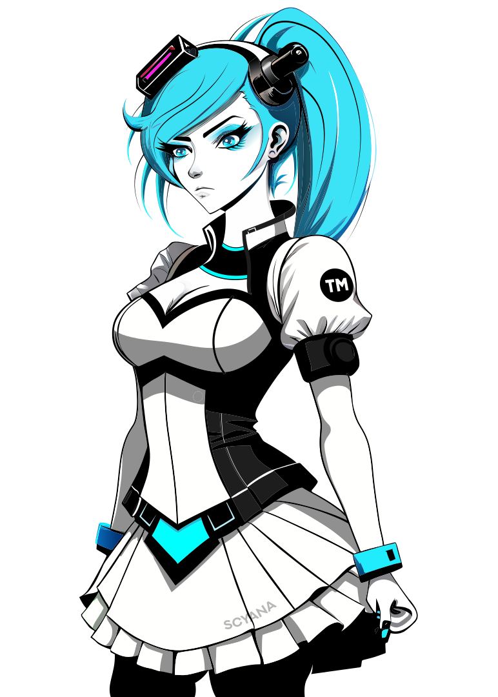
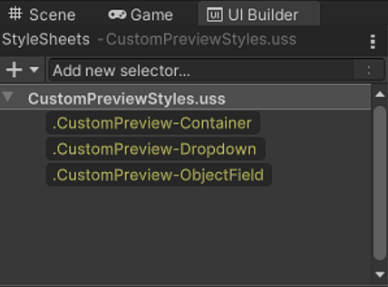
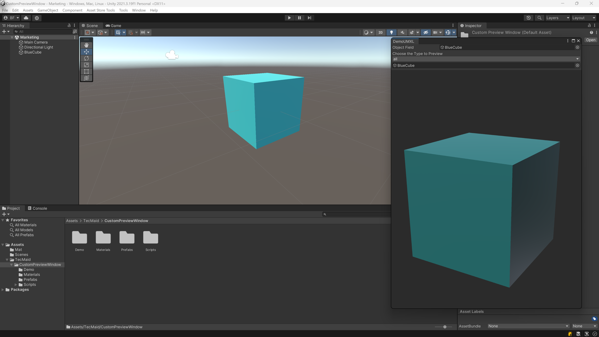
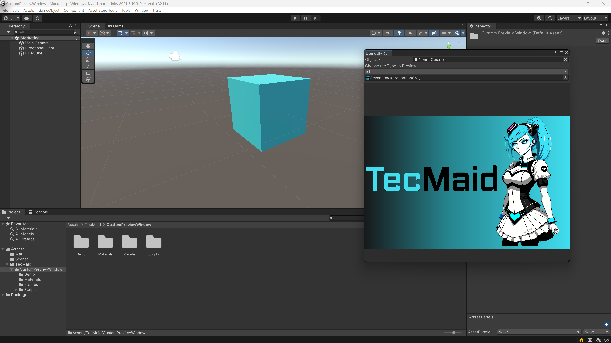

# CustomPreviewWindow (CPW)

 

Thank you for choosing the “CustomPreviewWindow” from TecMaid. This documentation contains everything you need to know to get started. If you have any questions, encounter a problem, or need help with integration, please do not hesitate to contact us at service@tecmaid.com.

## Table of Contents

- CustomPreviewWindow (CPW)
    - Introduction
    - Settings
    - Installation Instruction
    - How to use
    - Examples (Demo)
    - Troubleshooting
    - Useful Links

## Introduction

Ever miss the simplicity of preview windows from UGUI? Custom Preview Window, or CPW, brings back that practicality while tapping into Unity’s new UI Toolkit power. No fuss, no frills—just an easy preview integration with CPW. 
CPW is a custom control element designed to enhance your Unity UI Toolkit experience by letting you add a preview window into your Editor UIs and plugins developed using Unity UI Toolkit, which doesn’t support a Preview Window natively.
This tool is ideal for visualizing gameobjects, textures, materials, meshes and shaders.

## Settings

You can edit the visual settings of the CustomPreviewWindow using the included “CustomPreviewStyles.uss” file and editing the classes which are defined within.

## Installation Instructions

Here's a brief example of how to import "CustomPreviewWindow" into your Project:

1.	Open Unity and Your Project:
    - Open Unity Hub, select your project, and open it in the Unity Editor.

2.	Open the Package Manager:
    - Go to Window => Package Manager.

3.	Search for " CustomPreviewWindow ":
    - In the Package Manager window, make sure you’re the “Packages: XXX” setting is set to “Packages: My Assets”. 
    - Find " CustomPreviewWindow " in the results and click on it.

4.	Download and Import:
    - Click the "Download" button (if it's not already downloaded).
    - After downloading, click "Import".
    - In the "Import Unity Package" window, click "Import" to bring all the CustomPreviewWindow files into your project

5.	Verify Import:
    - Check the Assets folder in the Project window to ensure that the CustomPreviewWindow files are present.
    - You can now start using “CustomPreviewWindow” Demo via the Tools menu: Tools => DemoUXML.
    - By following these steps and the following “How to use” instructions, you can easily install and start using CustomPreviewWindow in your projects.

## How to use

This guide is for developers with knowledge of Unity, UI Toolkit, and C# scripting. 
It mentions the following topics:
- UXML
- USS
- UI Builder
- UI Toolkit
- Custom Controls

*Links to the respective topic documentation, can be found under “Useful Links” section.*

1. Open UI Builder: 

**Method 1:** To do this, go to Window => UI Toolkit => UI Builder. This will open the UI Builder window where you can create and edit UI elements.

IMAGE+++++

IMAGE+++++

**Method 2:** In the Project window, right-click in the Assets folder or any subfolder where you want to create the UI Document.
Select Create => UI Toolkit => UI Document.
A new UI Document (UXML) will be created. Rename it to something you like.
Double-Click on your created file and the UI-Builder Window should open.

IMAGE+++++

IMAGE+++++

2. In the UI Builder, go to the "Library" panel, then select the "Project" tab. Navigate to:
“Custom Controls (C#)” => “TecMaid_CustomPreviewWindow” => “CustomPreviewWindow”

IMAGE+++++

3. How to Use in Project: 
CPW can be used like any other UI Builder Standard component. Drop "CustomPreviewWindow" script into your UXML project to add it.

IMAGE+++++

4. To add styles to CPW components:
Copy the content from the imported "CustomPreviewStyles.uss" into your own .USS file to edit the CPW part.
- In the UI Builder, go to the “StyleSheets” panel.
- Click the “+” button and select “Add Existing USS”.
- In the new window that opens, navigate to:
- Assets\TecMaid\CustomPreviewWindow\Scripts\Styles\CustomPreviewStyles.uss
- Select “CustomPreviewStyles.uss”.
- This will import the stylesheet, allowing you to customize the CPW components.

IMAGE+++++

IMAGE+++++

## Examples (Demo)

## Troubleshooting

## Useful Links

- [Unity Docs: UIE-simple-ui-toolkit-workflow](https://docs.unity3d.com/Manual/UIE-simple-ui-toolkit-workflow.html)
- [Unity Docs: UIElements](https://docs.unity3d.com/Manual/UIElements.html)
- [Unity Docs: UIE-UXML](https://docs.unity3d.com/Manual/UIE-UXML.html)
- [Unity Docs: UIE-USS](https://docs.unity3d.com/Manual/UIE-USS.html)
- [Unity Docs: UIBuilder](https://docs.unity3d.com/Manual/UIBuilder.html)
- [Unity Docs: UIE-custom-controls](https://docs.unity3d.com/Manual/UIE-custom-controls.html)
- [Unity Technologies Git Repository](https://github.com/Unity-Technologies/ui-toolkit-manual-code-examples/tree/master)

